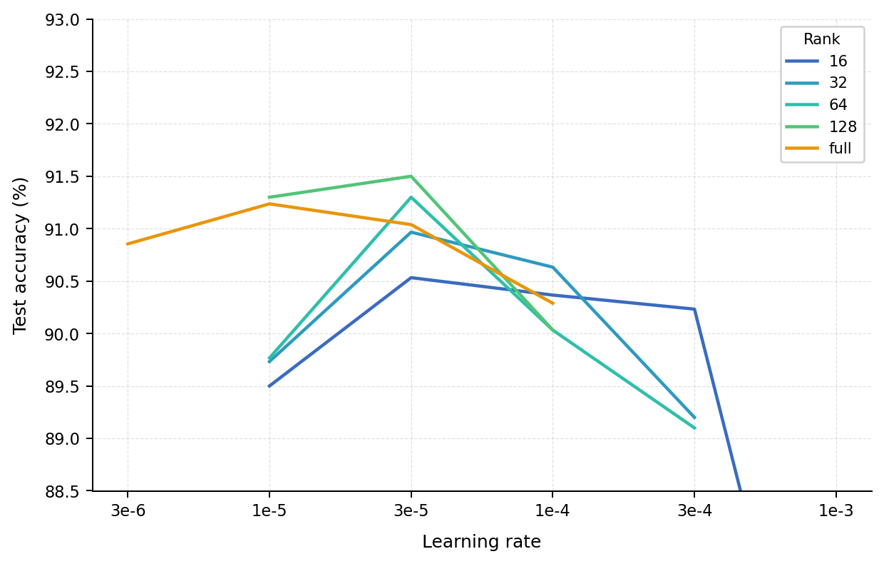
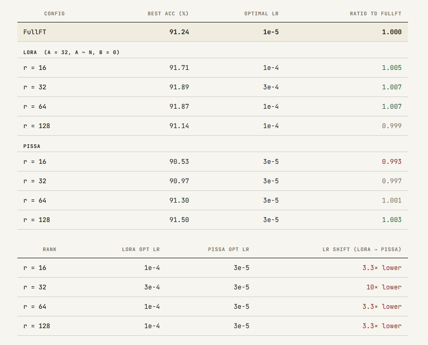

# Pissa-Without-Regret
Reproducing Pissa from scratch (no HF) and applying findings of the Lora-Without-Regret blog.


## Pissa-Without-Regret findings

This an extension from previous work of reporudicing the Lora-Without-Regret blog and investigating LoRA and FullFT optimal LR ratio.

### Let' see how different is Pissa using the blog's recommended configuration.

We use similar setup to our Lora-without-regret one using:
- `A` initalized using uniform distributin and `B` is zero
- We use a constant `alpha` value of `32` and factor by `1/r`
- We set a fixed `lr` (no scheduler) used by both adapters
- We train  `Distil-bert-uncased` on a `10k` subset of AG-News (classifcation)

   <br>
  
<p align="center">
  
</p>
<br>

We observe that the optimal LR for Pissa is only **3 times** bigger than FullFT optimal LR and that accuracy increases by rank.
Based on LoRA results shared in previous work, we provide the following comparaison table:
   <br>
  
<p align="center">
  
</p>
<br>


# Pissa Wihtout Regret Fine-tuning
---
## Setup
```bash
pip install -r requirements.txt
```

## Requirements
```
torch
transformers
datasets
scikit-learn
scipy
```
---
## Usage

### Basic run (LoRA with default params)
```bash
python main.py
```

### Full fine-tuning
```bash
python main.py --full-finetune
```

### LoRA vs Full Fine-tuning examples

LoRA (default):
```bash
python main.py --epochs 10 --rank 64 
```

Full Fine-tuning:
```bash
python main.py --full-finetune --epochs 10
```
---
## Parameters

- `--lrs`: Learning rates to sweep (default: 1e-4 5e-4 1e-3)
- `--epochs`: Number of training epochs (default: 5)
- `--rank`: LoRA rank (default: 128)
- `--batch_size`: Batch size (default: 32)
- `--seed`: Random seed (default: 42)
- `--full-finetune`: Use full fine-tuning instead of Pissa

## Output

Results saved to `results.json`:
```json
{
  "0.0001": {
    "best_val_loss": 0.1989,
    "test_acc": 0.9234,
    "train_losses": [...],
    "val_losses": [...]
  }
}
```


